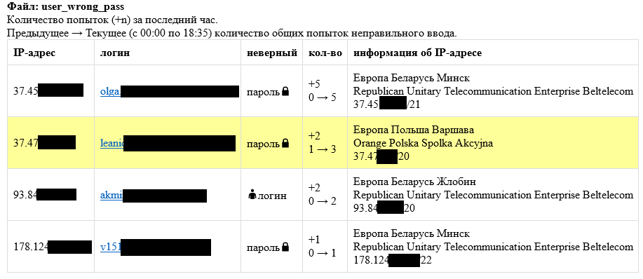
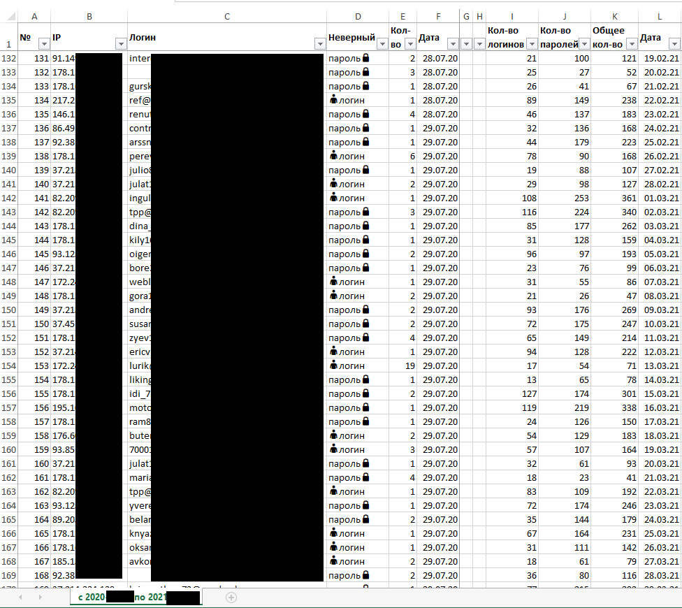

## Working projects
1. [Сборщик логов 1](#Сборщик-логов-1)
2. [Сборщик логов 2](#Сборщик-логов-2)
3. [Сборщик логов 3](#Сборщик-логов-3)

### Сборщик логов 1
```
Автоматизация анализа логов удаленного доступа работников к внутренней инфраструктуре предприятия
```
- подключение к удаленному серверу 
  - уведомление на почту в случае ошибок подключения 
- сбор логов 
- анализ полученных логов
  - проверка схожих файлов с ранее загруженными 
- подготовка логов к парсингу
  - формирование файла с новыми строками логов
- парсинг
  - формирование списков новых и завершенных подключений
- добавление в базу инфомации
  - новые подключения
  - обновление информации, когда подключение завершено

Код:
[SSH_Connection.py](./SSH_Connection.py)

##### main
```python
if __name__ == '__main__':
    #  MAKING A CONNECTION
    ssh = paramiko.SSHClient()
    ssh.set_missing_host_key_policy(paramiko.AutoAddPolicy())
    create_connection(ssh, 'gate')
    ftp_client = ssh.open_sftp()
    
    while True:
        if not ssh.get_transport().is_active():
            ssh.close()
            print(f'Current ssh connection closed and try to reopen')
            create_connection(ssh, 'gate')
        if ssh.get_transport().is_active():
            get_remote_files()
            check_similar_files()
            generate_logs_for_adding_to_db()
            print(f'Received and checked, Logs create: '
                  f'{datetime.now().strftime("%d.%m.%Y %H:%M:%S")}')
            parse_log_add_to_database()
        sleep_for(60)  # delay for 1 minute
    
    ftp_client.close()
    ssh.close()
```

##### визуализация таймера ожидания
```python
def sleep_for(seconds):
    if seconds <= 0:
        return
    start_division = seconds / 10 if seconds >= 10 else 10 / seconds
    division = start_division
    done = 0
    undone = 10
    for i in range(seconds):
        if i <= division and seconds < 10:
            division += start_division
            done += int(start_division)
            undone -= int(start_division)
        if i >= division and seconds >= 10:
            division += start_division
            done += 1
            undone -= 1
        sys.stdout.write(f"\r{round(i*100/seconds,1):>4}% [{'=' * done}{' ' * undone}]"
                         f" Waiting for {seconds - i} seconds ...")
        sys.stdout.flush()
        time.sleep(1)

    sys.stdout.write("\r")
    sys.stdout.flush()
```

##### уведомление на почту
```python
def send_email(subject, error, bodyText):
    try:
        with open("parameters.txt", "r") as file:
            data = json.loads(file.read())

        # Define the SMTP server credentials here:
        port = data['email']['port']
        smtp_server = data['email']['smtp_server']
        username = data['email']['username']
        password = data['email']['password']

        # specify the sender’s and receiver’s email addresses
        sender = data['email']['sender']
        receiver = data['email']['receiver']

        # type your message: use two newlines (\n) to separate the subject from the message body,
        # and use 'f' to  automatically insert variables in the text
        message = f"Subject: {subject} \n" \
                  f"To: {receiver} \n" \
                  f"From: {sender} \n" \
                  f"\n" \
                  f"Error : {error}\n\n" \
                  f"{bodyText}"

        # send your message with credentials specified above
        with smtplib.SMTP_SSL(smtp_server, port) as server:
            server.login(username, password)
            server.sendmail(sender, receiver, message.encode('utf8'))  # utf8 for correct display cyrillic
            server.quit()

        # tell the script to report if your message was sent or which errors need to be fixed
        now = datetime.now()
        dt_string = now.strftime("%d.%m.%Y %H:%M:%S")
        print(f'Email from {sender} to {receiver} sent on {dt_string} successfully')
    except (gaierror, ConnectionRefusedError):
        print('Failed to connect to the SMTP server. Bad connection settings')
    except smtplib.SMTPServerDisconnected:
        print('Failed to connect to the SMTP server. Wrong user/password')
    except smtplib.SMTPException as e:
        print('SMTP error occurred: ' + str(e))
```

##### подключение к удаленному серверу
```python
def create_connection(ssh, server):
    now = datetime.now()
    dt_string = now.strftime("%d.%m.%Y %H:%M:%S")
    isEmailSend = False
    while True:
        try:
            #  READ PARAMETERS FROM JSON
            with open("parameters.txt", "r") as file:
                data = json.loads(file.read())
            ssh.connect(data[server]['ip'], data[server]['port'], data[server]['username'], data[server]['password'])
            if isEmailSend:
                now = datetime.now()
                dt_string = now.strftime("%d.%m.%Y %H:%M:%S")
                send_email(f'Script ({get_my_local_ip()}) successfully connected via SSH to Bel VPN Gate',
                           f'No errors found',
                           f'SSH to Bel VPN Gate is available again since last check = {dt_string}')
                isEmailSend = False
            break
        except (paramiko.ssh_exception.BadHostKeyException,
                paramiko.ssh_exception.AuthenticationException,
                paramiko.ssh_exception.SSHException,
                paramiko.ssh_exception.socket.error) as error:
            print(f'Error: {error}')
            print(f"Server not available from last check = {dt_string}")
            if not isEmailSend:
                send_email(f'Script ({get_my_local_ip()}) failed to connect via SSH to Bel VPN Gate',
                           error,
                           f'Bel VPN Gate is not available since last check = {dt_string}')
                isEmailSend = True
            print(f'Sleep for 1 minute')
            sleep_for(60)  # delay for 1 minute
```

##### сбор логов
```python
@rerun
def get_remote_files():

    for fname in os.listdir(LOG_FOLDER):
        if fname.endswith('.log'):
            os.remove(f'{LOG_FOLDER}{fname}')

    for i in range(2, -1, -1):
        remote_path = f'/var/log/cspvpngate.log' if i == 0 else f'/var/log/cspvpngate.log.{i}'

        info = ftp_client.stat(remote_path)
        ftp_client.get(remote_path,
                       f'{LOG_FOLDER}'
                       f'{str(datetime.fromtimestamp(info.st_mtime)).replace(":", "-").replace(" ", "_")}_'
                       f'remote_log_{i}.log')

        time.sleep(1)
```

##### проверка схожих файлов с ранее загруженными
```python
@rerun
def check_similar_files():
    files = os.listdir(LOG_FOLDER)

    # filecmp.cmp - COMPARE remote_log_2 WITH last remote_log_saved
    if not filecmp.cmp(f'{LOG_FOLDER}{files[-3]}',
                       f'{LOG_FOLDER}{files[-4]}'):

        # CREATE FILENAME TO new_filename_to_save
        new_index = int(files[-4].split(".")[1]) + 1  # GET last remote_log_saved with index AND GET new index
        temp = f'{files[-3]}'.split("_")
        new_filename_to_save = f'{temp[0]}_{temp[1]}_remote_log_saved.{new_index}'

        # RENAME remote_log_2 to new name with new index
        os.rename(fr'{LOG_FOLDER}{files[-3]}', fr'{LOG_FOLDER}{new_filename_to_save}')

    else:
        # DELETE remote_log_2
        for fname in os.listdir(LOG_FOLDER):
            if fname.endswith('remote_log_2.log'):
                os.remove(f'{LOG_FOLDER}{fname}')
```

##### подготовка логов (формирование файла с новыми строками логов)
```python
@rerun
def generate_logs_for_adding_to_db():

    ### 1) DELETE previous file ###
    filenames = os.listdir(LOGS_TO_PARSE_FOLDER)  # GET ALL FILE NAMES IN DIRECTORY
    for filename in filenames:
        if filename.startswith('previous'):
            os.remove(f'{LOGS_TO_PARSE_FOLDER}{filename}')
    ### end of 1 ##################

    ### 2) Rename new_... to previous_... ###
    filenames = os.listdir(LOGS_TO_PARSE_FOLDER)
    oldNameToNew = [filename for filename in filenames if filename.startswith('new')][0]  # GET filename start with new_...
    newNameToNew = oldNameToNew.replace('new', 'previous')  # Rename filename start with new_... to previous_...
    os.rename(fr'{LOGS_TO_PARSE_FOLDER}{oldNameToNew}', fr'{LOGS_TO_PARSE_FOLDER}{newNameToNew}')
    ### end of 2 ############################


    ### 3) concatenate remote_log_0 and remote_log_1 and save to new_... ###
    filenames = os.listdir(LOG_FOLDER)  # GET ALL FILE NAMES IN DIRECTORY
    current_log_0_name = filenames[-1]
    current_log_1_name = filenames[-2]
    filenames = [current_log_1_name, current_log_0_name]
    current_log_0_name = current_log_0_name.replace('.log', '')
    current_log_1_name = current_log_1_name.replace('.log', '')
    newFilename = f'new_{current_log_1_name}+{current_log_0_name}.log'

    filepath = os.path.join(LOGS_TO_PARSE_FOLDER, newFilename)
    with open(filepath, 'w') as outfile:
        for filename in filenames:
            filepath = os.path.join(LOG_FOLDER, filename)
            with open(filepath) as infile:
                for line in infile:
                    outfile.write(line)
    ### end of 3 ############################################################


    ### 4) get lines only from a new file and save to logsForAddingToDB.log ###
    filenames = os.listdir(LOGS_TO_PARSE_FOLDER)  # GET ALL FILE NAMES IN DIRECTORY

    previousFilepath = os.path.join(LOGS_TO_PARSE_FOLDER,
                                    [filename for filename in filenames if filename.startswith('previous')][0])
    newFilepath = os.path.join(LOGS_TO_PARSE_FOLDER,
                               [filename for filename in filenames if filename.startswith('new')][0])

    previousFile = open(previousFilepath).readlines()
    newFile = open(newFilepath).readlines()
    with open(f'{LOGS_TO_PARSE_FOLDER}logsForAddingToDB.log', 'w') as outfile:
        with open(f'{LOGS_TO_PARSE_FOLDER}temp_logsForAddingToDB.log', 'a') as temp_outfile:
            for line in difflib.unified_diff(previousFile, newFile):
                if line[0] == "+" and line[1] != "+":
                    outfile.write(line[1:])
                    temp_outfile.write(line[1:])
    ### end of 4 #################################################################
```

##### парсинг
```python
def parse_log_add_to_database():
    FILENAME = "temp_logsForAddingToDB.log"
    listOpenedConnect = []
    listClosedConnect = []
    filepath = os.path.join(LOGS_TO_PARSE_FOLDER, FILENAME)
    with open(filepath) as infile:
        for i, line in enumerate(infile):
            data = line.split()
            # 00100119 - start of connections, 0010011d - end of connections
            if len(data) >= 5 and (data[5] == '00100119' or data[5] == '0010011d'):
                # 00100119 - start of connections
                if data[5] == '00100119':
                    localDestinationIP, localSourceIP = data[13].replace(',','').split("->")
                    remoteIP, remotePort = data[15].replace(',', '').split(":")
                    *_, client_id = data[17].split(",")[0].replace('"CN=','').split("_")
                    tempOpenConnDict = {'msg_id': data[5],
                                        'datetime': datetime.strptime(f'{datetime.now().year} {data[0]} {data[1]} {data[2]}',
                                                                      '%Y %b %d %H:%M:%S'),
                                        'connection_number': int(data[9]),
                                        'localSourceIP': localSourceIP,
                                        'localDestinationIP': localDestinationIP,
                                        'remoteIP': remoteIP,
                                        'remotePort': int(remotePort),
                                        'client_id': int(client_id)
                                        }
                    listOpenedConnect.append(tempOpenConnDict)
                # 0010011d - end of connections
                if data[5] == '0010011d':
                    tempClosConnDict = {'msg_id': data[5],
                                        'datetime': datetime.strptime(f'{datetime.now().year} {data[0]} {data[1]} {data[2]}',
                                                                      '%Y %b %d %H:%M:%S'),
                                        'connection_number': int(data[8]),
                                        'bytes_sent': int(data[10]),
                                        'bytes_received': int(data[13])
                                        }
                    listClosedConnect.append(tempClosConnDict)

    add_to_database(listOpenedConnect, listClosedConnect)
```

##### добавление в базу
```python
isEmailSend_database = False


def add_to_database(listOpenedConnect, listClosedConnect):
    db_connection = psycopg2
    global isEmailSend_database

    try:
        #  READ PARAMETERS FROM JSON
        with open("parameters.txt", "r") as file:
            data = json.loads(file.read())
        db_connection = psycopg2.connect(user=data['postgreSQL']['user'],
                                         password=data['postgreSQL']['password'],
                                         host=data['postgreSQL']['host'],
                                         port=data['postgreSQL']['port'],
                                         database=data['postgreSQL']['database'])
        db_cursor = db_connection.cursor()
        db_connection.autocommit = True

        for item in listOpenedConnect:
            postgres_insert_query = f" SELECT full_name, is_fired FROM workers " \
                                    f" WHERE client_id = {item['client_id']} "
            db_cursor.execute(postgres_insert_query)
            full_name, is_fired = db_cursor.fetchone()
            full_name = full_name.strip()
            postgres_insert_query = """ INSERT INTO statistics
            (connection_number, start_connection, client_id, full_name, is_fired,
            local_source_IP, local_destination_ip, remote_ip, remote_port)
            VALUES (%s,%s,%s,%s,%s,%s,%s,%s,%s)"""
            record_to_insert = (item['connection_number'], item['datetime'], item['client_id'], full_name, is_fired,
                                item['localSourceIP'], item['localDestinationIP'], item['remoteIP'], item['remotePort'])
            db_cursor.execute(postgres_insert_query, record_to_insert)

        for item in listClosedConnect:
            postgres_insert_query = f" SELECT start_connection FROM statistics " \
                                    f" WHERE connection_number = {item['connection_number']} " \
                                    f" ORDER BY start_connection DESC"
            db_cursor.execute(postgres_insert_query)
            record = db_cursor.fetchone()
            if record:
                postgres_insert_query = f" UPDATE statistics " \
                                        f" SET end_connection = %s ," \
                                        f"     connection_time = %s ," \
                                        f"     bytes_sent = %s ," \
                                        f"     bytes_received = %s ," \
                                        f"     total_traffic = %s " \
                                        f" FROM (SELECT * FROM statistics " \
                                        f" Where connection_number = {item['connection_number']} " \
                                        f" ORDER BY start_connection DESC " \
                                        f" LIMIT 1) as sub " \
                                        f" Where statistics.start_connection = sub.start_connection"
                record_to_insert = (item['datetime'], item['datetime'] - record[0], item['bytes_sent'],
                                    item['bytes_received'], item['bytes_sent'] + item['bytes_received'])
                db_cursor.execute(postgres_insert_query, record_to_insert)

        if (db_connection):
            db_cursor.close()
            db_connection.close()

            # DELETE temp_logsForAddingToDB.log
            for filename in os.listdir(LOGS_TO_PARSE_FOLDER):
                if filename.startswith('temp_logsForAddingToDB.log'):
                    os.remove(f'{LOGS_TO_PARSE_FOLDER}{filename}')

        if isEmailSend_database:
            now = datetime.now()
            dt_string = now.strftime("%d.%m.%Y %H:%M:%S")
            send_email(f'Successfully insert records into database table {get_my_local_ip()}',
                       f'No errors found',
                       f'Operations with database is available again since last check = {dt_string}')
            isEmailSend_database = False

    except (Exception, psycopg2.Error) as error:
        if(db_connection):
            if not isEmailSend_database:
                now = datetime.now()
                dt_string = now.strftime("%d.%m.%Y %H:%M:%S")
                send_email(f'Failed to insert BelVPNGate log records into database table {get_my_local_ip()}',
                           str(error).strip(),
                           f'Operations with database not available from last check = {dt_string}\n\n'
                           f'All logs will be added to a temporary file "temp_logsForAddingToDB.log"\n'
                           f'Upon successful connection to the database, these logs will be written to the database')
                isEmailSend_database = True
            print("Database error: ", str(error).strip())
```

### Сборщик логов 2
```
Сбор логов и анализ количества неудачных попыток аутентификации с внешних ip-адресов к порталу услуг
```
- сбор логов с внешнего сервера портала услуг
- формирование ежечасовой/суточной сводки по новым/суточным неудачным попыткам аутентификации
- сбор информации об ip-адресах
- формирование письма в удобочитаемую таблицу
- отправка уведомления на почту 

Код:
[portal.py](./portal.py)

##### Пример части ежечасовой сводки


##### main
```
schedule.every().day.at("00:25").do(day_report)
schedule.every().day.at("00:20").do(job, True)
schedule.every().hour.at(":35").do(job)
# нужно для запуска планировщика с периодом в 1 секунду:
while True:
    schedule.run_pending()
    time.sleep(1)
```

##### формирование ежечасовой сводки с уведомлением на почту
```python
def job(yesterday_flag=None):
    if not os.path.exists(PATH_TO_STATISTICS):
        print(f"{PATH_TO_STATISTICS} does not exist")
        return
    if not os.path.exists(PORTAL_LOG_FOLDER):
        print(f"{PORTAL_LOG_FOLDER} does not exist")
        return

    ### 1) DELETE previous file ###
    filenames = os.listdir(PORTAL_LOG_FOLDER)  # GET ALL FILE NAMES IN DIRECTORY
    for filename in filenames:
        if filename.startswith('previous'):
            os.remove(f'{PORTAL_LOG_FOLDER}{filename}')
    ### end of 1 ##################

    ### 2) Rename current_... to previous_... ###
    filenames = os.listdir(PORTAL_LOG_FOLDER)
    for filename in filenames:
        if filename.startswith('current'):
            new_filename = filename.replace('current',
                                            'previous')  # Rename filename start with current_... to previous_...
            os.rename(fr'{PORTAL_LOG_FOLDER}{filename}', fr'{PORTAL_LOG_FOLDER}{new_filename}')
    ### end of 2 ############################

    now = datetime.now()
    current_date = now.date()
    yesterday_date = current_date - timedelta(days=1)

    for filename in Files:
        str_file_pass = fr"{PATH_TO_STATISTICS}{current_date}/{current_date}_{filename.value}" \
            if not yesterday_flag \
            else fr"{PATH_TO_STATISTICS}{yesterday_date}/{yesterday_date}_{filename.value}"
        if os.path.exists(str_file_pass):
            with open(str_file_pass, 'r') as file:
                output = os.path.join(PORTAL_LOG_FOLDER, f'current_{filename.value[:-4]}.txt')
                with open(output, 'w') as output:
                    for line in file:
                        output.write(line)
        else:
            print(f"{str_file_pass} does not exist")


    start_time = f'00:00' if not yesterday_flag else f'{yesterday_date.strftime("%d.%m.%Y")} 00:00'
    end_time = f'{now.strftime("%H:%M")}' if not yesterday_flag else f'{now.strftime("%d.%m.%Y %H:%M")}'
    start_to_end = f'(с {start_time} по {end_time})'

    body_text = ''
    empty_str = '""\n'
    no_rows_str = '"no rows selected"\n'
    rows_selected_str = "rows selected."


    previousFilepath_user_wrong_pass = os.path.join(PORTAL_LOG_FOLDER, 'previous_user_wrong_pass.txt')
    currentFilepath_user_wrong_pass = os.path.join(PORTAL_LOG_FOLDER, 'current_user_wrong_pass.txt')
    previousFile = open(previousFilepath_user_wrong_pass).readlines()
    currentFile = open(currentFilepath_user_wrong_pass).readlines()
    currentFilepath_fail_user_wrong_pass = os.path.join(PORTAL_LOG_FOLDER, 'current_fail-user_wrong_pass.txt')
    currentFile_fail_user_wrong_pass = open(currentFilepath_fail_user_wrong_pass).readlines()
    temp_user_wrong_pass = f'Файл: user_wrong_pass\n' \
        f'Количество попыток (+n) за последний час.\n' \
        f'Предыдущее → Текущее {start_to_end} количество общих попыток неправильного ввода.\n' \
        f'IP-адрес | логин | неверный | кол-во | информация об IP-адресе\n'
    temp_list = []
    previousCount = 0
    for line in difflib.unified_diff(previousFile, currentFile):
        if line[0] == "-" and line[1] != "-":
            if line[1:] != empty_str and line[1:] != no_rows_str and rows_selected_str not in line[1:]:
                previousCount = int(line[2:-2].split('","')[2])
        if line[0] == "+" and line[1] != "+":
            if line[1:] != empty_str and line[1:] != no_rows_str and rows_selected_str not in line[1:]:
                wrong = '👤логин' if line[1:] in currentFile_fail_user_wrong_pass else 'пароль🔒'
                data = line[2:-2].split('","')
                currentCount = int(data[2])
                delta = f'+{currentCount - previousCount};{previousCount} → {currentCount}'
                ip_info = get_ip_info(data[0]) if is_good_ipv4(data[0]) else ""
                temp_list.append((data[0], data[1], wrong, int(data[2]), delta, ip_info))
                previousCount = 0

    temp_list = sorted(temp_list, key=itemgetter(3), reverse=True)
    temp = ""
    for element in temp_list:
        temp += f'{element[0]} | {element[1]} | {element[2]} | {element[4]} | {element[5]}\n'
    if temp:
        temp_user_wrong_pass += temp
        body_text += temp_user_wrong_pass


    previousFilepath_user_block = os.path.join(PORTAL_LOG_FOLDER, 'previous_user_block.txt')
    currentFilepath_user_block = os.path.join(PORTAL_LOG_FOLDER, 'current_user_block.txt')
    previousFile = open(previousFilepath_user_block).readlines()
    currentFile = open(currentFilepath_user_block).readlines()
    temp_user_block = f'\nФайл: user_block\n' \
        f'Количество попыток (+n) за последний час.\n' \
        f'Предыдущее → Текущее {start_to_end} количество общих событий блокировки пользователя ' \
                      f'при превышении лимита неправильных попыток ввода.\n' \
        f'логин | кол-во\n'
    temp_list = []
    previousCount = 0
    for line in difflib.unified_diff(previousFile, currentFile):
        if line[0] == "-" and line[1] != "-":
            if line[1:] != empty_str and line[1:] != no_rows_str and rows_selected_str not in line[1:]:
                previousCount = int(line[2:-2].split('","')[1])
        if line[0] == "+" and line[1] != "+":
            if line[1:] != empty_str and line[1:] != no_rows_str and rows_selected_str not in line[1:]:
                data = line[2:-2].split('","')
                currentCount = int(data[1])
                delta = f'+{currentCount - previousCount};{previousCount} → {currentCount}'
                temp_list.append((data[0], int(data[1]), delta))
                previousCount = 0
    temp_list = sorted(temp_list, key=itemgetter(1), reverse=True)
    temp = ""
    for element in temp_list:
        temp += f'{element[0]} | {element[2]}\n'
    if temp:
        temp_user_block += temp
        temp_user_block += "\n\tПримечание:\n" \
            "\tЛимит 10 неправильных попыток, блокировка на 30 минут.\n" \
            "\tЕсли за 24 часа (период сброса счетчика попыток), " \
            "количество неправильных попыток меньше 10 и период этот истек, счетчик неправильных попыток обнуляется.\n" \
            "\tЛогин вида avest-XXXXXXXXX-XXXXXXXXXXXpbX - это ЭЦП (попытки входа с ЭЦП), " \
            "который у нас ещё не зарегистрован в виде учетной записи.\n"
        body_text += temp_user_block

    if body_text:
        send_email(body_text, "Неудачные попытки авторизации - portal.gov.by")

    now = datetime.now().strftime("%d.%m.%Y %H:%M:%S")
    print(now)
```

##### формирование суточной сводки с уведомлением на почту
```python
def day_report():
    now = datetime.now()
    current_date = now.date()
    yesterday_date = current_date - timedelta(days=1)

    body_text = ''
    empty_str = '""\n'
    no_rows_str = '"no rows selected"\n'
    rows_selected_str = "rows selected."
    first_line1 = '"SQL> @/data/log/stat_var1_command.sql"\n'
    first_line2 = '"SQL> @/data/log/stat_var2_command.sql"\n'
    first_line3 = '"SQL> @/data/log/stat_var3_command.sql"\n'
    last_line = '"SQL> SPOOL OFF"\n'

    path_fail_user_wrong_pass = f"{PATH_TO_STATISTICS}{yesterday_date}/{yesterday_date}_fail-user_wrong_pass.csv"
    file_fail_user_wrong_pass = open(path_fail_user_wrong_pass).readlines()

    str_user_wrong_pass = fr"{PATH_TO_STATISTICS}{yesterday_date}/{yesterday_date}_user_wrong_pass.csv"
    if os.path.exists(str_user_wrong_pass):
        with open(str_user_wrong_pass, 'r') as file:
            temp_user_wrong_pass = 'Файл: user_wrong_pass\n' \
                                   'Общее суточное количество попыток неправильного ввода пароля (для любых учетных записей - существующих и несуществующих).\n' \
                                   'IP-адрес | логин | неверный | кол-во | информация об IP-адресе\n'
            temp_list = []
            for line in file:
                if line != empty_str and line != no_rows_str and rows_selected_str not in line\
                        and line != first_line1 and line != last_line:
                    wrong = '👤логин' if line in file_fail_user_wrong_pass else 'пароль🔒'
                    data = line[1:-2].split('","')
                    ip_info = get_ip_info(data[0]) if is_good_ipv4(data[0]) else ""
                    temp_list.append((data[0], data[1], wrong, int(data[2]), ip_info))
            temp_list = sorted(temp_list, key=itemgetter(3), reverse=True)
            temp = ""
            for element in temp_list:
                temp += f'{element[0]} | {element[1]} | {element[2]} | {element[3]} | {element[4]}\n'
            if temp:
                temp_user_wrong_pass += temp
                body_text += temp_user_wrong_pass
    else:
        print(f"{str_user_wrong_pass} does not exist")

    str_user_block = fr"{PATH_TO_STATISTICS}{yesterday_date}/{yesterday_date}_user_block.csv"
    if os.path.exists(str_user_block):
        with open(str_user_block, 'r') as file:
            temp_user_block = '\nФайл: user_block\n' \
                              'Общее суточное количество событий блокировки пользователя при превышении лимита неправильных попыток ввода.\n' \
                              'логин | кол-во\n'

            temp_list = []
            for line in file:
                if line != empty_str and line != no_rows_str and rows_selected_str not in line\
                        and line != first_line2 and line != last_line:
                    data = line[1:-2].split('","')
                    temp_list.append((data[0], int(data[1])))
            temp_list = sorted(temp_list, key=itemgetter(1), reverse=True)
            temp = ""
            for element in temp_list:
                temp += f'{element[0]} | {element[1]}\n'
            if temp:
                temp_user_block += temp
                temp_user_block += "\n\tПримечание:\n" \
                                   "\tЛимит 10 неправильных попыток, блокировка на 30 минут.\n" \
                                   "\tЕсли за 24 часа (период сброса счетчика попыток), " \
                                   "количество неправильных попыток меньше 10 и период этот истек, счетчик неправильных попыток обнуляется.\n" \
                                   "\tЛогин вида avest-XXXXXXXXX-XXXXXXXXXXXpbX - это ЭЦП (попытки входа с ЭЦП), " \
                                   "который у нас ещё не зарегистрован в виде учетной записи.\n"
                body_text += temp_user_block
    else:
        print(f"{str_user_block} does not exist")

    if body_text:
        body_text = 'Суточный отчет за: ' + str(yesterday_date.strftime("%d.%m.%Y"))\
                    + '\n\n' \
                    + body_text
        send_email(body_text, "Суточные неудачные попытки авторизации - portal.gov.by")

    now = datetime.now()
    print('day report at:', now)
```

##### отправка уведомления на почту
```python
def send_email(bodyText, subject):
    try:
        with open("parameters.txt", "r") as file:
            data = json.loads(file.read())

        # Define the SMTP server credentials here:
        port = data['email']['port']
        smtp_server = data['email']['smtp_server']
        username = data['email']['username']
        password = data['email']['password']

        # specify the sender’s and receiver’s email addresses
        sender = data['email']['sender']
        receiver = data['email']['self_receiver']

        carbon_copy = f"{data['email']['receiver_1']}," \
                      f"{data['email']['receiver_2']}"

        message = MIMEMultipart("alternative")
        message["Subject"] = subject
        message["From"] = sender
        message["To"] = receiver
        message['CC'] = carbon_copy

        # write the HTML part
        html_bodyText = plain_to_html(bodyText)
        # convert both parts to MIMEText objects and add them to the MIMEMultipart message
        part1 = MIMEText(bodyText, "plain")
        part2 = MIMEText(html_bodyText, "html")
        message.attach(part1)
        message.attach(part2)

        list_receiver = list(receiver.split(","))
        list_carbon_copy = list(carbon_copy.split(","))
        # send your message with credentials specified above
        with smtplib.SMTP_SSL(smtp_server, port) as server:
            server.login(username, password)
            server.sendmail(sender, list_receiver + list_carbon_copy, message.as_string())
            server.quit()

        # tell the script to report if your message was sent or which errors need to be fixed
        now = datetime.now()
        dt_string = now.strftime("%d.%m.%Y %H:%M:%S")
        print(f'Email from {sender} to {receiver} sent on {dt_string} successfully')
    except (gaierror, ConnectionRefusedError):
        print('Failed to connect to the SMTP server. Bad connection settings')
    except smtplib.SMTPServerDisconnected:
        print('Failed to connect to the SMTP server. Wrong user/password')
    except smtplib.SMTPException as e:
        print('SMTP error occurred: ' + str(e))
```

##### формирование html страницы
```python
def plain_to_html(bodyText):

    temp_lines = '''<!DOCTYPE html>
        <html>
            <head>
                <meta charset="utf-8">
                <style>
                    table {
                      border-collapse: collapse;
                    }

                    td, th {
                      border: 1px solid #dddddd;
                      text-align: left;
                      padding: 8px;
                    }

                </style>
            </head>
            <body>

        '''
    lines = bodyText.split('\n')
    for i, line in enumerate(lines):
        line = line.replace(';', '<br>')
        if 'кол-во' in line:
            temp = '<table><tr>\n'
            for word in line.split(' | '):
                word = '<th>' + word.strip() + '</th>\n'
                temp += word
            line = temp + '</tr>\n'
        if '|' in line:
            temp = '<tr>\n' if 'Беларусь' in line else '<tr style="background-color:#FFFF99">\n'
            for word in line.split(' | '):
                word = '<td>' + word + '</td>\n'
                temp += word
            line = temp + '</tr>'
            if i + 1 <= len(lines) - 1:
                if '|' not in lines[i + 1]:
                    line += '</table>'
        if 'Файл' in line:
            line = '<strong>' + line + '</strong>'

        temp_words = ''
        for word in line.split(' '):
            temp_words += word + ' '
        if '<tr' in temp_words:
            temp_lines += temp_words
        else:
            temp_lines += temp_words + '<br>'

    bodyText = temp_lines + '\n' + '</body>' + '\n' + '</html>'
    return bodyText
```

##### сбор информации об внешних ip-адресах
```python
def is_good_ipv4(s):
    pieces = s.split('.')
    if len(pieces) != 4:
        return False
    try:
        return all(0 <= int(p) < 256 for p in pieces)
    except ValueError:
        return False

def get_ip_info(ip):
    url = f"https://geolite.info/geoip/v2.1/city/{ip}"
    with open("parameters.txt", "r") as file:
        params = json.loads(file.read())
    request = requests.get(url, auth=(params["maxmind"]["account_id"],
                                      params["maxmind"]["license_key"]))
    status_code = request.status_code
    ip_info = ''
    result = ''
    if status_code != 404:
        result = request.json()
        # print('JSON:\n', json.dumps(result, indent=4, ensure_ascii=False))
    if str(status_code).startswith('4') or \
            str(status_code).startswith('5'):
        if 'code' in result:
            if result['code'] == 'IP_ADDRESS_RESERVED':
                ip_info += 'Зарезервированный IP-адресс'
        print('bad status code : ', result)
    else:
        if 'continent' in result:
            if 'names' in result['continent']:
                continent = result['continent']['names']['ru'] \
                    if 'ru' in result['continent']['names'] \
                    else result['continent']['names']['en']
                ip_info += f'{continent} '
        if 'country' in result:
            if 'names' in result['country']:
                country = result['country']['names']['ru'] \
                    if 'ru' in result['country']['names'] \
                    else result['country']['names']['en']
                ip_info += f'{country} '
        if 'city' in result:
            if 'names' in result['city']:
                city = result['city']['names']['ru'] \
                    if 'ru' in result['city']['names'] \
                    else result['city']['names']['en']
                ip_info += f'{city} '
        if 'subdivisions' in result:
            if 'names' in result['subdivisions']:
                subdivisions = result['subdivisions']['names']['ru'] \
                    if 'ru' in result['subdivisions']['names'] \
                    else result['subdivisions']['names']['en']
                ip_info += f'{subdivisions} '
        if 'traits' in result:
            if 'autonomous_system_organization' in result['traits']:
                organization = result['traits']['autonomous_system_organization']
                ip_info += f';{organization};'
            if 'network' in result['traits']:
                network = result['traits']['network']
                ip_info += f'{network}'

    return ip_info
```

### Сборщик логов 3
```
Суммарный отчет по неудачным попыткам авторизации на портал услуг
```
- сбор логов с внешнего сервера портала услуг
- формирование общего отчета (таблица в Excel)
- отправка отчета на почту 

Код:
[generate_report_portal.py](./generate_report_portal.py)

##### Пример части ежечасовой сводки

